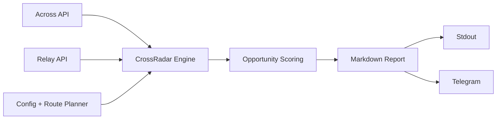

# CrossRadar

CrossRadar scans **Across + Relay** activity and surfaces the **best bridge opportunity signals** in a rolling window.

It runs stateless, ranks routes by a simple opportunity score, prints a report, and can post the same report to Telegram.

## What it does
- Pulls recent route activity from Across and Relay public APIs.
- Computes per-route metrics (flow, success, completion speed, USD volume when available).
- Converts metrics into ranked opportunity signals (`opportunity_score`, `est_edge_bps`, confidence, risk).
- Auto-selects busiest routes (`DYNAMIC_ROUTES=true`) with protocol fallbacks.

## Flow (visual)


## Quick start
```bash
pnpm install
pnpm start
```

### Required env for Telegram posting
```bash
TELEGRAM_BOT_TOKEN=...
TELEGRAM_CHAT_ID=...
```

If Telegram env vars are missing, CrossRadar runs in dry mode (prints only).

## Useful commands
```bash
pnpm start      # single run
pnpm dev        # loop mode (--loop)
pnpm test       # test suite
```

## Current project stage
CrossRadar is currently strongest as a **live opportunity radar**.

The repo also includes **quote-vs-fill opportunity engine building blocks** (join logic, EV/risk formulas, quality gates, backtest primitives) for the next stage toward solver-grade quote/skip decisions.
